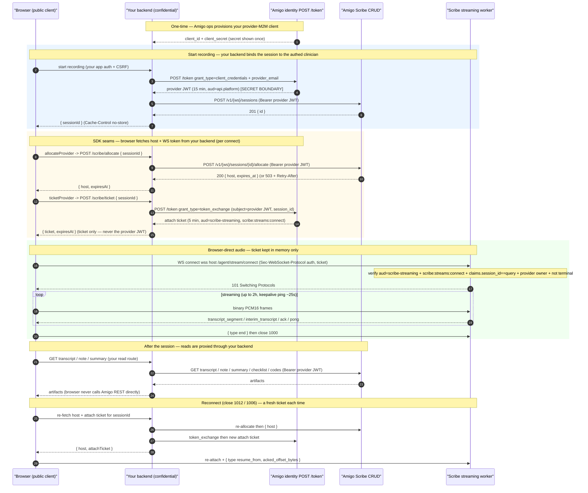

# Scribe streaming — customer integration guide

This is the single document a customer engineer follows to go from **zero → a
working in-person Scribe recording** using `@amigo-ai/scribe`.

It integrates in-person Scribe streaming with the **split-trust** model: your
**backend** is a confidential machine-to-machine (M2M) client that holds the
secret and mints tokens; your **browser** runs `@amigo-ai/scribe` and streams
audio with only a short-lived, single-session **attach ticket**. The secret and
the provider JWT never leave your server.

> **Audience:** an external customer building their own product on the Amigo
> Scribe API. If you are integrating the first-party Amigo web app, that path
> uses a same-origin BFF and is out of scope here.

---

## 1. Architecture and trust boundaries

There are two trust tiers. Everything privileged lives on your backend; the
browser only ever holds a credential good for one thing: attaching to one
session's WebSocket.

|                        | **Your backend** (confidential)                                                                                                            | **Your browser** (public)                                                              |
| ---------------------- | ------------------------------------------------------------------------------------------------------------------------------------------ | -------------------------------------------------------------------------------------- |
| Holds                  | `client_id` + `client_secret`; per-clinician provider JWT (15 min)                                                                         | one **attach ticket** (WS-only, ~5 min)                                                |
| Auth to Amigo          | `POST /token` `grant_type=client_credentials` + `provider_email` → provider JWT                                                            | `Sec-WebSocket-Protocol: "auth, <attach-ticket>"` on WS attach                         |
| Token audience / scope | `https://api.platform.amigo.ai` / `scribe:sessions:write` (+ `scribe:sessions:read_own`, `scribe:notes:rw_own`)                            | `scribe-streaming` / `scribe:streams:connect` **only**                                 |
| Can do                 | create session, allocate a host, mint attach tickets, read transcript / note / summary / checklist / codes for its own provider's sessions | attach to **one** WS session, stream PCM16 up, receive that session's transcripts down |
| Cannot do              | (full provider scope for its own sessions)                                                                                                 | any REST call (audience rejected); attach to any other session; mint further tickets   |
| Network                | server→server to `scribe.platform.amigo.ai` + `api.platform.amigo.ai` (no CORS)                                                            | WS-only to `wss://<gameserver>.actors.platform.amigo.ai`                               |

**The three requests your backend makes to Amigo per recording:**

1. **Mint a per-clinician provider token** — `grant_type=client_credentials` +
   `provider_email` (act-as-by-email). The email is the logged-in clinician's,
   taken from _your_ app session — never supplied by the browser.
2. **Create + allocate** — `createSession` then `allocate` (via the SDK's
   `ScribeClient` or REST), using the provider token as the bearer.
3. **Mint the browser's attach ticket** — `grant_type=token_exchange`, exchanging
   the provider token for a session-bound, WS-only ticket. Return **only**
   `{ ticket, expiresAt }` (plus the `host`) to the browser.

The browser then attaches its WebSocket directly to the streaming host with the
ticket, streams PCM16 up, and receives transcript frames down.

### Recommended architecture: browser talks directly to Amigo **only** for the WebSocket

The browser makes exactly **one** direct connection to Amigo — the streaming
**WebSocket** (`wss://<host>/agent/stream/connect`), authed with the short-lived
attach ticket. **Everything else goes through your backend:**

- **Browser → your backend → Amigo REST** for all CRUD: create-session,
  allocate, and every read (get-transcript / note / summary / checklist / codes).
  Your backend attaches the provider JWT as the bearer and proxies the result
  back. The browser **never** calls the Amigo REST API directly and **never**
  holds the provider JWT.
- **Browser → Amigo WebSocket (direct)** with the attach ticket only.

This keeps the provider credential entirely server-side and means Amigo's REST
API needs no CORS configuration for your browser origin (the only cross-origin
link is the WS, which is not subject to CORS — the attach ticket is its
authorization boundary). Concretely, the browser SDK's `allocateProvider` seam
calls _your_ allocate route (not Amigo), and any transcript/artifact display in
the browser fetches from _your_ read routes, which proxy to Amigo.

### Sequence diagram



**Trust boundaries.** `[SECRET BOUNDARY]` marks your backend: the
`client_secret` and every provider JWT live only there. Everything the browser
receives is single-session and short-lived. Note the two distinct lifetimes:
the **allocation lease** (`expires_at`, ~2 h) and the **attach window**
(`expiresAt`, ~5 min).

---

## 2. Prerequisites and setup

### 2.1 A provider-M2M client (obtained once)

Your backend authenticates to Amigo with a **confidential provider-M2M client**:
a `client_id` + `client_secret` scoped to your **workspace**. Amigo ops
provisions this for you initially (self-serve provisioning is a later addition).

When provisioned you receive:

- `client_id` — non-secret identifier.
- `client_secret` — **shown once**. Store it in your server-side secret manager;
  never commit it, log it, or ship it to the browser.
- `workspace_id` — the workspace all your sessions live in.
- `allowed_scopes` — by default
  `{ scribe:sessions:write, scribe:sessions:read_own, scribe:notes:rw_own }`,
  which covers the full CRUD + artifact path.

The client is **workspace-scoped**: it can act as any clinician who holds an
active Scribe access grant in that workspace (see below), and can only touch
sessions owned by those clinicians.

### 2.2 Scribe access grants (per clinician)

The M2M client cannot invent clinicians. Each clinician who will record must
have an **active Scribe access grant** in your workspace, keyed by their email.
The grant is the authority the act-as-by-email mint resolves against.

- Grants are provisioned by Amigo ops / a workspace admin (self-serve
  management endpoints are being added).
- Only an **active** grant mints a token. Unknown / pending / revoked emails
  fail closed with `invalid_target` (see §3.3 and Troubleshooting).
- A clinician whose grant **requires MFA** cannot use the M2M path at all — a
  machine cannot satisfy an interactive MFA challenge, so the mint fails closed.
  This is the **MFA carve-out** (§3.4).

### 2.3 Scopes

| Scope                      | Held by                        | Purpose                                      |
| -------------------------- | ------------------------------ | -------------------------------------------- |
| `scribe:sessions:write`    | backend provider JWT           | create session, allocate                     |
| `scribe:sessions:read_own` | backend provider JWT           | read session + transcript + artifacts        |
| `scribe:notes:rw_own`      | backend provider JWT           | generate / finalize note, summary, checklist |
| `scribe:streams:connect`   | browser attach ticket **only** | attach to one session's WebSocket            |

`scribe:streams:connect` is a **non-REST** scope on the `scribe-streaming`
audience: an attach ticket is rejected at every REST endpoint, and a REST
provider JWT is rejected at the WebSocket. The two credentials are not
interchangeable.

---

## 3. Backend integration

Your backend implements four things Amigo needs, plus one route the browser
calls. All of it runs server-side; the browser never sees a provider JWT or the
client secret.

The reference implementation below mirrors the SDK's own end-to-end test helpers
(`tests/e2e/scribe-auth.ts`), which exercise this exact flow against the real
staging stack in CI.

### 3.1 Mint a per-clinician provider token (act-as-by-email)

`POST {identityBaseUrl}/token`, **form-urlencoded**:

| field            | value                                                  |
| ---------------- | ------------------------------------------------------ |
| `grant_type`     | `client_credentials`                                   |
| `client_id`      | your M2M client id                                     |
| `client_secret`  | your M2M client secret                                 |
| `provider_email` | the logged-in clinician's email (lower-cased, trimmed) |

Response: `{ access_token, token_type, expires_in, scope }`. The `access_token`
is a **provider JWT** (`aud=https://api.platform.amigo.ai`, ~15 min) whose `sub`
is the clinician's provider entity. Use it as the bearer for create/allocate and
as the `subject_token` for the attach-ticket exchange.

> **Never** take `provider_email` from the browser. Derive it from your own
> authenticated app session for the clinician who is recording.

**Caching the provider token (optional).** The provider JWT is valid ~15 min, so
your backend may cache it per clinician to avoid re-minting on every request —
either **in memory** or in a key-value store **encrypted with a symmetric key**.
Respect its TTL: re-mint shortly _before_ expiry, and key the cache by
`(workspace, provider_email)`. Never persist it unencrypted and never expose it
to the browser. Do **not** cache the attach ticket — it is short-lived (~5 min)
and minted fresh per WS (re)connect (§3.3).

### 3.2 Create and allocate

Use the SDK's `ScribeClient` (or call the REST endpoints directly):

- `createSession` → `POST /v1/{workspace_id}/sessions` → `201` with `{ id, ... }`.
- `allocate` → `POST /v1/{workspace_id}/sessions/{session_id}/allocate` → `200`
  `{ host, expires_at }`. On capacity exhaustion / per-session cooldown it
  returns `503` with a `Retry-After` header (surfaced by the SDK as
  `ServiceUnavailableError.retryAfterSeconds`).

> **The browser never allocates.** Allocation happens on your backend (or via
> the browser SDK's `allocateProvider` seam, which calls _your_ allocate route).
> `allocate` has a per-session cooldown, so allocate **once** per (re)connect —
> don't pre-allocate and then let the SDK allocate again, or the second call
> `503`s.

### 3.3 Mint the browser's attach ticket

`POST {identityBaseUrl}/token`, **form-urlencoded**:

| field           | value                                        |
| --------------- | -------------------------------------------- |
| `grant_type`    | `token_exchange`                             |
| `subject_token` | the provider JWT from §3.1                   |
| `session_id`    | the Scribe `session_id` from `createSession` |

Response: `{ access_token, token_type, expires_in }`. The `access_token` is the
**attach ticket**: `aud=scribe-streaming`, scope `scribe:streams:connect` only,
bound to that one `session_id` / workspace / provider, 5-min TTL (`expires_in`
300). Return **only** the ticket (and its expiry) to the browser.

> The server sets the audience and scope for you. If you send them explicitly
> they must match exactly (`audience=scribe-streaming`, `scope=scribe:streams:connect`),
> and `subject_token_type`, if supplied, must be
> `urn:ietf:params:oauth:token-type:access_token`. The minimal form above (just
> `grant_type` + `subject_token` + `session_id`) is sufficient.

**Anti-escalation:** a ticket can never be exchanged again — a `scribe-streaming`
subject is rejected. Only a full provider JWT can mint a ticket.

### 3.4 Fail-closed behaviors to handle

- **`invalid_target` (400)** on the `client_credentials` mint → the clinician has
  no active, non-MFA grant in your workspace (unknown / pending / revoked /
  cross-workspace / **MFA-required**). Surface a clean "this clinician isn't
  enabled for Scribe" error; do not retry blindly.
- **MFA carve-out** — an MFA-required grant fails closed by design. Clinicians
  gated behind MFA cannot use the machine-delegated path.
- **`invalid_scope` / `invalid_request` (400)** → a malformed exchange request
  (see Troubleshooting).
- **`503` + `Retry-After`** on `allocate` → Fleet at capacity or cooldown; back
  off for the indicated seconds and retry.

---

## 4. Browser integration (`@amigo-ai/scribe`)

The browser uses `ScribeStreamClient` — the recording-independent WebSocket
client. It attaches with an attach ticket, streams caller-supplied PCM16, and
handles keepalive + resumable reconnect. **It never holds a provider credential
or mints tickets.** You wire it to your backend through two injected seams:

- `ticketProvider(sessionId)` → `{ ticket, expiresAt? }` — calls your ticket
  route (§3.3). **Re-invoked on every (re)connect.**
- `allocateProvider(sessionId)` → `{ host, expiresAt }` — calls your allocate
  route (§3.2). **Re-invoked on every reconnect** (a new host each time).

**How the ticket becomes the WS auth token.** The browser never mints the ticket
— it gets it from your backend through `ticketProvider`. On `connect()` the
client (1) calls `allocateProvider(sessionId)` → `host`, (2) calls
`ticketProvider(sessionId)` → `ticket`, then (3) opens
`new WebSocket("wss://<host>/agent/stream/connect?session_id=…", ["auth", <ticket>])`.
A WebSocket upgrade can't carry an `Authorization` header, so the ticket rides as
the **second value of the `Sec-WebSocket-Protocol` header** (after the literal
`"auth"`) — the SDK builds this for you. The worker reads the ticket from that
subprotocol, verifies `aud=scribe-streaming` + `scribe:streams:connect` +
`claims.session_id == the query session_id` + provider ownership, and accepts (or
closes `4001`/`4004`/`4009`). Because both seams run on every connect, the token
is always freshly minted for the connection it authorizes — including the very
first one.

Events: `onTurn(segment)`, `onStateChange(state)`, `onReconnect()`,
`onError(err)`. State machine (`ScribeStreamState`): `idle → connecting →
streaming → paused → reconnecting → ended | failed`.

Reconnect is automatic on close `1012` (try-again) and `1006` (abnormal), and
**never** on `1000` (clean) / `4001` (auth) / `4009` (terminal). On reconnect the
client re-invokes both seams (fresh host + fresh ticket), re-attaches the same
session, sends `resume_from{acked_offset_bytes}`, and resends only the unacked
ring-buffer audio.

> **Audio capture.** `ScribeStreamClient` has **no** mic code — you feed it PCM16
> via `sendAudio(ArrayBuffer | Uint8Array)`. A higher-level `ScribeRecorder` that
> owns `getUserMedia` → PCM16 capture and drives the client is **not yet shipped**
> (SDK phase 16, in progress) — see §7. Until it lands, capture PCM16 yourself
> (16 kHz mono, little-endian `Int16`) and call `sendAudio`.

### The WebSocket is browser-direct

`ScribeStreamClient` runs **in the browser** and opens the WebSocket **directly to
the allocated Amigo gameserver** (`wss://<host>.actors.platform.amigo.ai`) — that
socket is the one browser↔Amigo hop (§1). Only REST and the two mints are proxied
through your backend. You don't need any extra plumbing for the direct
connection; using `ScribeStreamClient` _is_ how the browser connects directly.

### Low-level primitives (build your own client)

The socket lifecycle — subprotocol handshake (`["auth", ticket]`), app-level
keepalive, reconnect/backoff, ring-buffer resend, and `resume_from` — is
encapsulated **inside `ScribeStreamClient`**; there is **no** separate exported
"open the socket" function, and for almost all customers `ScribeStreamClient` is
the right layer. If you must drive the socket yourself (e.g. a non-browser
runtime or a custom state machine), the SDK exports the full wire contract so you
don't have to reverse-engineer it:

- `buildWsUrl(host, sessionId)` and `WS_CONNECT_PATH` — the exact attach URL.
- `CLIENT_FRAME` / `SERVER_MESSAGE` / `CLOSE_CODE` enums and every frame type
  (`ResumeFromFrame`, `TranscriptSegmentFrame`, `AckFrame`, `PongFrame`, …).
- `shouldReconnect(code)`, `backoffDelayMs(attempt)`, `RECONNECT`,
  `KEEPALIVE_INTERVAL_MS` — the reconnect + keepalive policy.
- `AudioRingBuffer` (resend-unacked), `normalizeTurn`, `transcriptReducer` — the
  buffering + transcript-assembly helpers.

You still open the socket yourself as
`new WebSocket(buildWsUrl(host, sessionId), ['auth', ticket])`, sourcing `host`
and `ticket` from your backend exactly as the seams do. If you only need to swap
the **transport** (not the logic), prefer `ScribeStreamClient`'s
`webSocketFactory` option (typed `WsLike`) to inject a custom `WebSocket`
implementation while keeping the client's connection handling.

---

## 5. End-to-end code examples

### 5.1 Backend (framework-agnostic Node / TypeScript)

The two mints are plain form-encoded `POST`s to the identity `/token` endpoint;
create/allocate use the SDK. This mirrors `tests/e2e/scribe-auth.ts`.

```ts
import { ScribeClient } from '@amigo-ai/scribe'

const IDENTITY_BASE_URL = 'https://api.platform.amigo.ai' // identity /token
const SCRIBE_BASE_URL = 'https://scribe.platform.amigo.ai' // Scribe CRUD
const WORKSPACE_ID = process.env.AMIGO_WORKSPACE_ID!
const CLIENT_ID = process.env.AMIGO_M2M_CLIENT_ID!
const CLIENT_SECRET = process.env.AMIGO_M2M_CLIENT_SECRET! // server-side only

async function postToken(
  form: URLSearchParams
): Promise<{ access_token: string; expires_in?: number }> {
  const res = await fetch(`${IDENTITY_BASE_URL}/token`, {
    method: 'POST',
    headers: {
      'Content-Type': 'application/x-www-form-urlencoded',
      Accept: 'application/json',
    },
    body: form.toString(),
  })
  if (!res.ok) {
    const body = (await res.json().catch(() => null)) as { error?: string } | null
    throw new Error(`token ${form.get('grant_type')} failed: ${res.status} ${body?.error ?? ''}`)
  }
  return res.json()
}

// (1) act-as-by-email provider token. `providerEmail` comes from YOUR app session.
async function mintProviderToken(providerEmail: string): Promise<string> {
  const form = new URLSearchParams({
    grant_type: 'client_credentials',
    client_id: CLIENT_ID,
    client_secret: CLIENT_SECRET,
    provider_email: providerEmail.trim().toLowerCase(),
  })
  const { access_token } = await postToken(form)
  return access_token
}

// (3) session-bound, WS-only attach ticket.
async function mintAttachTicket(providerToken: string, sessionId: string) {
  const form = new URLSearchParams({
    grant_type: 'token_exchange',
    subject_token: providerToken,
    session_id: sessionId,
  })
  const { access_token, expires_in } = await postToken(form)
  const expiresAt =
    typeof expires_in === 'number'
      ? new Date(Date.now() + expires_in * 1000).toISOString()
      : undefined
  return { ticket: access_token, expiresAt }
}

function scribeFor(providerToken: string): ScribeClient {
  return new ScribeClient({
    baseUrl: SCRIBE_BASE_URL,
    token: providerToken,
    workspaceId: WORKSPACE_ID,
  })
}

// (2) "start recording": create the session and remember which clinician owns
// it. Return ONLY the sessionId — the browser SDK pulls host + ticket via the
// two seams below. Do NOT pre-allocate here: `allocate` has a per-session
// cooldown, so a pre-allocate + the SDK's own allocate would 503 the second call.
export async function startRecording(clinicianEmail: string) {
  const providerToken = await mintProviderToken(clinicianEmail)
  const session = await scribeFor(providerToken).createSession({
    external_id: `appt-${Date.now()}`,
  })
  await recordSessionOwner(session.id, clinicianEmail) // your DB: sessionId -> clinician
  return { sessionId: session.id } // the ONLY thing the browser needs to start
}

// Route the SDK's `allocateProvider` calls. Re-invoked on every (re)connect.
export async function allocateRoute(authedClinicianEmail: string, sessionId: string) {
  await assertOwns(authedClinicianEmail, sessionId) // never trust a raw browser id
  const providerToken = await mintProviderToken(authedClinicianEmail)
  const { host, expires_at } = await scribeFor(providerToken).allocate(sessionId)
  return { host, expiresAt: expires_at } // set `Cache-Control: no-store`
}

// Route the SDK's `ticketProvider` calls. Re-invoked on every (re)connect.
export async function ticketRoute(authedClinicianEmail: string, sessionId: string) {
  await assertOwns(authedClinicianEmail, sessionId)
  const providerToken = await mintProviderToken(authedClinicianEmail)
  const { ticket, expiresAt } = await mintAttachTicket(providerToken, sessionId)
  return { ticket, expiresAt } // ONLY the ticket — NEVER return providerToken. no-store.
}
```

Expose the last two as routes the browser SDK calls (both `Cache-Control: no-store`):

- `POST /scribe/allocate` → `allocateRoute(...)` → `{ host, expiresAt }` — backs
  the SDK's `allocateProvider` seam.
- `POST /scribe/ticket` → `ticketRoute(...)` → `{ ticket, expiresAt }` — backs
  the SDK's `ticketProvider` seam; this is **where the browser's WS auth token
  comes from**.

Both resolve the clinician from **your** authenticated app session and verify —
via `assertOwns` — that the `sessionId` belongs to them; never mint or allocate
for an arbitrary browser-supplied id (see §6). `mintProviderToken` may be cached
per clinician (§3.1) so these routes don't re-mint on every call.

### 5.2 Browser

```ts
import { ScribeStreamClient } from '@amigo-ai/scribe'
import type { SttTranscriptSegment } from '@amigo-ai/scribe'

// `sessionId` came from your "start recording" backend response.
async function record(sessionId: string) {
  const client = new ScribeStreamClient({
    sessionId,
    // Calls YOUR ticket route — re-invoked on every (re)connect. Never mints here.
    ticketProvider: async sid => {
      const r = await fetch('/scribe/ticket', {
        method: 'POST',
        headers: { 'Content-Type': 'application/json' },
        body: JSON.stringify({ sessionId: sid }),
      })
      const { ticket, expiresAt } = await r.json()
      return { ticket, expiresAt } // ticket kept in memory only — never localStorage
    },
    // Calls YOUR allocate route — re-invoked on every reconnect.
    allocateProvider: async sid => {
      const r = await fetch('/scribe/allocate', {
        method: 'POST',
        headers: { 'Content-Type': 'application/json' },
        body: JSON.stringify({ sessionId: sid }),
      })
      const { host, expiresAt } = await r.json()
      return { host, expiresAt }
    },
    onTurn: (segment: SttTranscriptSegment) => renderTranscript(segment),
    onStateChange: state => console.log('scribe state:', state),
    onReconnect: () => console.log('stream resumed'),
    onError: err => console.error('scribe error:', err),
  })

  await client.connect() // allocate -> mint ticket -> open WS

  // You own capture. Feed 16 kHz mono little-endian PCM16 as it arrives:
  //   client.sendAudio(pcm16Chunk) // ArrayBuffer | Uint8Array
  // client.pause() / client.resume() to pause without tearing down the socket.

  return client // call client.end() to finalize + close cleanly (1000)
}
```

Wiring mic capture into `sendAudio` (the `getUserMedia` → PCM16 pipeline) is
what the not-yet-shipped `ScribeRecorder` (§7) will encapsulate. Until then,
implement the capture pipeline yourself and pipe each PCM16 chunk to
`client.sendAudio`.

---

## 6. Security guidance

The split-trust model only holds if you keep the secret on the server and the
ticket ephemeral in the browser.

- **Secret storage / rotation.** The `client_secret` is a workspace-scoped
  delegation key: store it in a server-side secret manager, never in the browser,
  a repo, or logs. Rotate on the usual cadence and on any suspected exposure
  (contact Amigo ops to re-provision).
- **Never send the provider JWT to the browser.** It can create/allocate/read
  **every** session owned by that provider in the workspace. Only the attach
  ticket crosses to the browser. If you cache the provider JWT server-side to
  avoid re-minting (§3.1), keep it in memory or in a key-value store **encrypted
  with a symmetric key**, honor its TTL, and never expose it beyond the backend.
- **Browser calls Amigo directly only for the WebSocket.** Proxy all
  create/allocate/read (CRUD) calls through your backend (§1); the browser must
  not call the Amigo REST API directly or hold a provider credential.
- **Per-clinician ownership.** Bind every session to the authenticated portal
  user/tenant. Reject any browser-supplied `sessionId` for mint/allocate that
  the caller does not own — otherwise a user could attach to another clinician's
  session.
- **MFA carve-out.** Clinicians gated behind MFA cannot use the machine path
  (§3.4). Handle `invalid_target` as a clean "not enabled" state.
- **Ticket handling in the browser.** Keep the ticket **in memory only** — never
  `localStorage`/`sessionStorage`. Set `Cache-Control: no-store` on your ticket
  and allocate responses. The SDK re-mints per (re)connect, so there's no need to
  persist it.
- **CSP.** Allow the WS host explicitly, e.g.
  `connect-src wss://*.actors.platform.amigo.ai` (staging:
  `wss://*.actors-staging.platform.amigo.ai`).
- **Microphone.** Gate capture with a `Permissions-Policy` /
  `allow="microphone"` as appropriate for your embedding.
- **CSRF.** Your `/scribe/ticket` and `/scribe/allocate` routes are
  state-changing — apply your normal CSRF protection.
- **Log redaction.** The attach ticket rides in the `Sec-WebSocket-Protocol`
  header; redact that header in any proxy/access logs you control.

**Known interim posture (Amigo-side, tracked for hardening):** attach-ticket
single-use enforcement is deferred, so within its ~5-min window a captured ticket
could be replayed to the same session; and an established socket is validated
only at attach, so it may persist up to the ~2 h session cap. Blast radius is
bounded to the one session by the audience + scope + `session_id` + owner checks.

---

## 7. `ScribeRecorder` (SDK phase 16 — not yet shipped)

A browser **`ScribeRecorder`** that owns the mic (`getUserMedia` → PCM16
capture) and drives `ScribeStreamClient` for you — exposing `start / pause /
resume / end` plus the same events — is planned but **not yet available** in the
SDK (phase 16; no release contains it at the time of writing). Its intended
shape (from the phase-16 design, subject to change until it ships):

```ts
// PENDING — not yet available in @amigo-ai/scribe (phase 16, in progress).
const recorder = new ScribeRecorder({
  sessionId,
  ticketProvider, // same seams as ScribeStreamClient
  allocateProvider,
  onTurn,
  onStateChange,
})
await recorder.start() // connect + start mic capture -> sendAudio
recorder.pause()
recorder.resume()
recorder.end()
```

The `ticketProvider` / `allocateProvider` seams map 1:1 onto the ones shown in
§5.2, so code you write against `ScribeStreamClient` today carries over. **Until
it ships, use `ScribeStreamClient` + your own capture pipeline** (§4, §5.2).
Check the SDK release notes for availability.

---

## 8. Hosts and environments

| Purpose                                    | Production                                    | Staging                                               |
| ------------------------------------------ | --------------------------------------------- | ----------------------------------------------------- |
| Scribe CRUD API (`ScribeClient` `baseUrl`) | `https://scribe.platform.amigo.ai`            | `https://scribe-staging.platform.amigo.ai`            |
| Identity `/token` (mints)                  | `https://api.platform.amigo.ai`               | `https://api-staging.platform.amigo.ai`               |
| Streaming WS host (actors domain)          | `wss://<gameserver>.actors.platform.amigo.ai` | `wss://<gameserver>.actors-staging.platform.amigo.ai` |

The WS `host` is returned by `allocate` — you never hardcode a gameserver name;
you attach to `wss://<host>/agent/stream/connect?session_id=...` (the SDK's
`buildWsUrl` / `WS_CONNECT_PATH` do this for you).

---

## 9. Troubleshooting

### WebSocket close codes

| Code   | Meaning                                                                                                              | Reconnect?                       |
| ------ | -------------------------------------------------------------------------------------------------------------------- | -------------------------------- |
| `1000` | Clean close — session ended normally (`end()`).                                                                      | No                               |
| `1006` | Abnormal closure (no close frame).                                                                                   | **Yes**                          |
| `1011` | Server fatal error.                                                                                                  | No — surface it                  |
| `1012` | Try-again — session stays in-progress.                                                                               | **Yes**                          |
| `4000` | Bad request.                                                                                                         | No                               |
| `4001` | **Auth failure** — bad/expired ticket, wrong audience/scope, or the ticket's `session_id` ≠ the attach `session_id`. | No — re-mint via the flow        |
| `4004` | Session **not found / owner mismatch** — the provider doesn't own this session, or wrong workspace.                  | No                               |
| `4009` | Session in a **terminal** state (already ended/finalized).                                                           | No                               |
| `4013` | Worker at capacity.                                                                                                  | No — `allocate` handles capacity |

The SDK reconnects automatically only on `1012` / `1006`; all others are
terminal. A `4001` almost always means the ticket is stale, was minted for a
different `session_id`, or a REST provider JWT was mistakenly used at the WS.

### Token endpoint errors (OAuth envelope `{ error, error_description }`, HTTP 400)

| `error`           | Cause                                                                                                                              | Fix                                                                                                       |
| ----------------- | ---------------------------------------------------------------------------------------------------------------------------------- | --------------------------------------------------------------------------------------------------------- |
| `invalid_target`  | The `provider_email` has no active, non-MFA grant in the workspace (unknown / pending / revoked / cross-workspace / MFA-required). | Provision/activate a Scribe access grant for that clinician; MFA-gated clinicians can't use the M2M path. |
| `invalid_scope`   | Requested scope isn't allowed for this credential / grant.                                                                         | Use the default `allowed_scopes`; the attach ticket is `scribe:streams:connect` only.                     |
| `invalid_request` | Malformed request — e.g. missing `provider_email` on the M2M mint, or a bad `token_exchange` body.                                 | Check the form fields in §3.1 / §3.3.                                                                     |

### Allocate `503`

`allocate` returns `503` with a `Retry-After` header when the streaming Fleet is
exhausted or the per-session cooldown is active. The SDK raises
`ServiceUnavailableError` with `retryAfterSeconds` — back off for that many
seconds and retry. Do **not** loop tightly.

### A REST call rejects the ticket / a WS attach rejects the JWT

This is by design. The attach ticket (`aud=scribe-streaming`) is rejected at
every REST endpoint; a REST provider JWT (`aud=https://api.platform.amigo.ai`)
is rejected at the WebSocket. Use the provider JWT for CRUD and the attach ticket
for the WS — they are not interchangeable.
</content>
</invoke>
